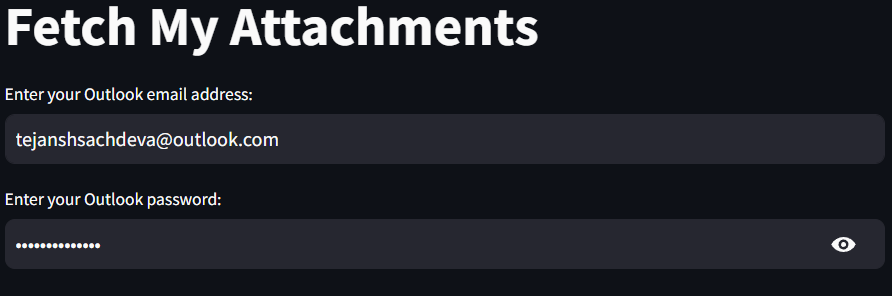
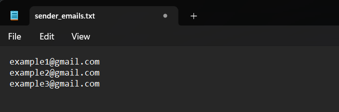
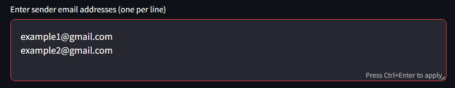
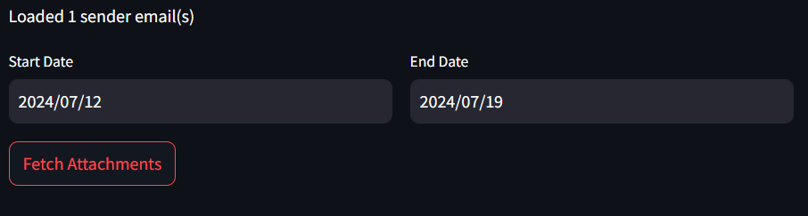
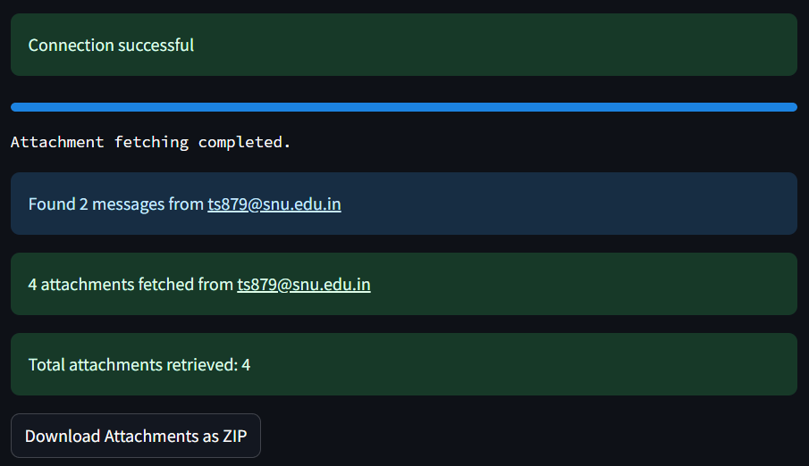
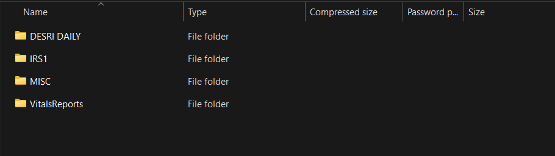

# Fetch My Attachments - Walkthrough

### Overview

This Streamlit app allows users to fetch email attachments from their Outlook account based on specific criteria. The attachments will be organized into a zip file with categorized folders. Follow the steps below to use the app.

You can access the app through this link: [https://fetchmyattachments.streamlit.app/](https://fetchmyattachments.streamlit.app/)

### Step-by-Step Guide

1. **Enter Your Outlook Email Address and Password:**

   - **Email Address:** Input the Outlook email address where you receive the emails from which attachments are to be fetched.
   - **Password:** Enter the password for your Outlook email. This is necessary for the app to access your emails. Click on the eye icon to reveal the password if needed.
   - **Submit:** Press the 'Enter' key or click outside the box to proceed after entering the password.

     
2. You have **two options** to specify the sender email addresses, choose any one:

   1. **Upload a Text File:** Click on the 'Browse files' button or drag and drop a text file (.txt) containing the sender email addresses. Each email address should be on a new line.


      ##### Format of .txt file:

      
   2. **Enter Manually:** Alternatively, you can manually enter the sender email addresses in the provided text box. Each email address should be on a new line.

      
3. **Specify the Date Range:**

   - **Start Date:** Select the start date from which you want to search for attachments.
   - **End Date:** Select the end date up to which you want to search for attachments.
4. **Fetch Attachments:**

   - Click the **'Fetch Attachments'** button to start the process. The app will now access your Outlook account, search for emails from the specified senders within the provided date range, and fetch the attachments. This process might take a few seconds or even minutes.

     
     After clicking on **"Fetch Attachments"**, you will see **"Connection Successfull"** which means that your **Outlook Account** is successfully connected.

     
5. **Download the Zip File:**

   - Once the process is complete, the app will generate a zip file containing the fetched attachments. The zip file will have the following structure:

     
   - ```
     FetchedAttachments/
     ├── VitalsReports/
     ├── DESRI DAILY/
     ├── IRS1/
     └── MISC/
     ```
   - The folders will contain the PDFs fetched according to their names:

     - **VitalsReports:** Contains vital reports.
     - **DESRI DAILY:** Contains daily reports from DESRI.
     - **IRS1:** Contains IRS1-related documents.
     - **MISC:** Contains miscellaneous documents that do not fit into the above categories.

### Additional Information

- Ensure your email credentials are correct to avoid authentication errors.
- If the text file is too large or incorrectly formatted, you may encounter errors. Ensure each email address is on a new line.
- The date range should be valid and within the past to avoid errors in fetching attachments.

### Troubleshooting and Support

By following these instructions, you can seamlessly fetch and categorize attachments from your Outlook emails. Should you encounter any problems or need further assistance, please consult the error messages provided by the app for guidance. For additional support, feel free to **create an issue** on our GitHub repository: [Submit an Issue](https://github.com/tejanshsachdeva/FetchMyAttachments/issues)

---
